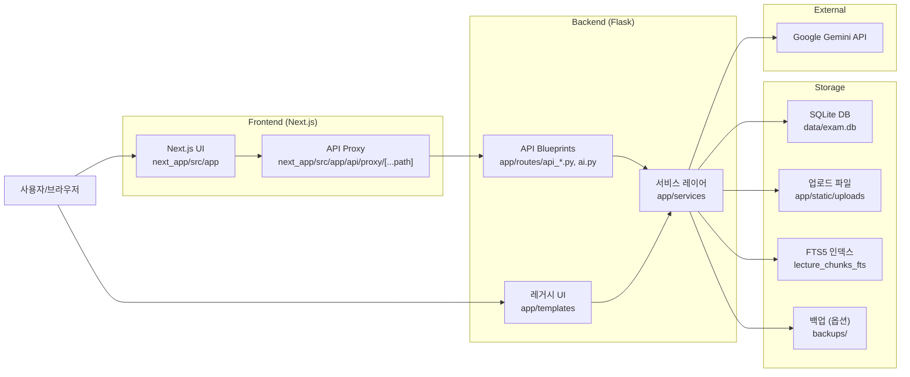
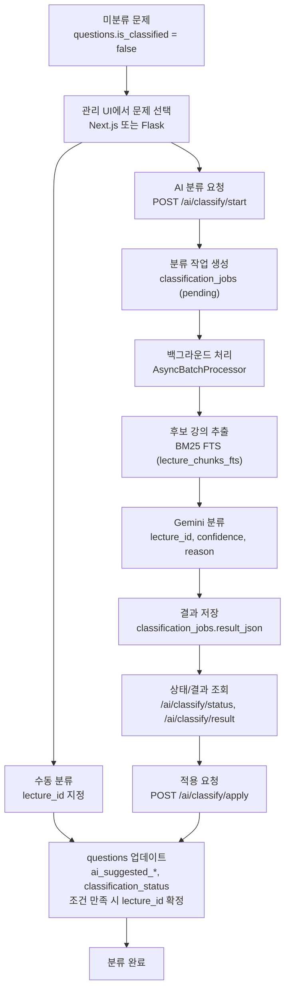
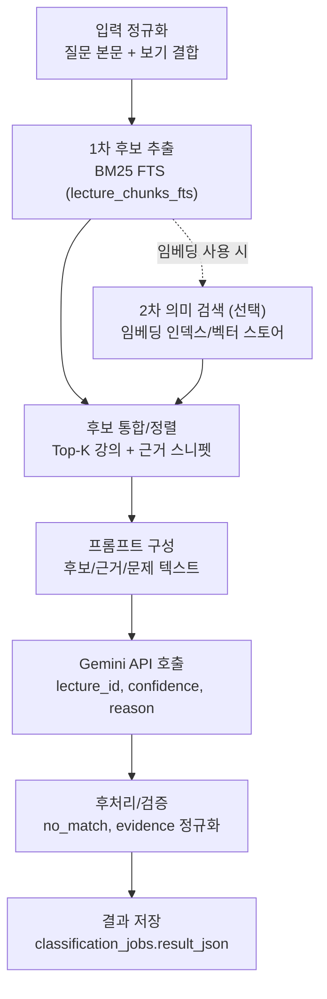

# 아키텍처 개요

이 문서는 Exam Manager의 전체 구조와 핵심 파이프라인을 요약합니다. Next.js UI와 Flask API/레거시 UI가 함께 동작하며, SQLite 단일 파일 DB와 파일 업로드/FTS 인덱스를 중심으로 데이터를 처리합니다.

## 구성 요소 요약
- Frontend: Next.js App Router (`next_app/src/app`)
- Backend: Flask (Blueprint 기반 API + 레거시 Jinja UI)
- DB: SQLite (`data/exam.db`, Local admin은 `data/admin_local.db`)
- 파일 저장소: `app/static/uploads` (Local admin은 `uploads_admin`)
- AI 분류: Google Gemini + FTS(BM25) 후보 추출

## 디렉터리/모듈 맵
- `app/`: Flask 애플리케이션
  - `app/routes/`: Blueprint 라우트 (manage/exam/practice/ai/api)
  - `app/services/`: 비즈니스 로직 (PDF 파서, AI 분류, 인덱싱, DB 안전장치)
  - `app/models.py`: SQLAlchemy 모델 (스키마 기준)
  - `app/templates/`: 레거시 서버 렌더링 UI
  - `app/static/uploads/`: 업로드 파일 저장소
- `next_app/`: Next.js App Router
  - `next_app/src/app`: 페이지/라우트
  - `next_app/src/app/api/proxy/[...path]`: Flask API 프록시
- `data/`: SQLite DB 파일 보관
- `migrations/`: SQL 마이그레이션 파일
- `scripts/`: 운영/초기화 유틸리티 (`init_fts.py`, `run_migrations.py` 등)

## 실행 모드/진입점
- `run.py`: 기본 Flask 실행 (`config.py`의 기본 설정)
- `run_local_admin.py`: Local admin 모드
  - 별도 DB(`data/admin_local.db`)
  - 업로드 경로 `uploads_admin`
  - `PDF_PARSER_MODE=experimental` 고정
- `next_app`: Next.js 개발 서버 (기본 `http://localhost:3000`)

## 데이터/스토리지 구조
- SQLite
  - 기본: `data/exam.db`
  - Local admin: `data/admin_local.db`
- 업로드 파일
  - 기본: `app/static/uploads`
  - Local admin: `app/static/uploads_admin`
- 강의 노트 인덱스
  - `lecture_chunks` 테이블 + `lecture_chunks_fts`(FTS5)
  - 초기화/동기화: `python scripts/init_fts.py --sync`
- 백업 (옵션)
  - `AUTO_BACKUP_BEFORE_WRITE=1` 시 `backups/`에 자동 백업 생성

## 프론트엔드/백엔드 파이프라인 (큰 틀)

### 파이프라인 설명
- Next.js UI는 `/api/proxy/*`를 통해 Flask API로 요청을 전달합니다 (`FLASK_BASE_URL` 기반).
- 일부 관리/연습 화면은 Flask 레거시 UI(Jinja)에서 직접 렌더링됩니다.
- Flask 서비스 레이어가 DB/파일/FTS/AI 호출을 조합해 처리합니다.
- 운영 안전장치: `DB_READ_ONLY`, `AUTO_BACKUP_BEFORE_WRITE`, `ENFORCE_BACKUP_BEFORE_WRITE`가 쓰기 작업을 보호합니다.

## 주요 흐름 요약
- PDF 업로드
  - Next.js 관리 UI → Flask `/api/manage/*` → `app/services/pdf_parser*.py`
  - `previous_exams`, `questions`, `choices` 저장 + 이미지 파일 생성
- 강의 노트 인덱싱
  - 레거시 `/manage/lecture/<id>` 업로드 → `lecture_indexer.py`
  - `lecture_chunks` 생성 + `lecture_chunks_fts` 업데이트
- 연습/채점
  - Next.js `/lectures`, `/practice` → Flask `/api/practice/*`
  - 세션/결과는 서버에서 저장 (클라이언트 fallback 존재)

## 핵심 문제 분류 과정 (AI/수동)

#### BM25 → 임베딩 → Gemini 상세 흐름

설명:
- 입력 정규화는 문제 본문과 선택지를 결합해 검색용 텍스트를 만듭니다.
- 1차 후보는 FTS(BM25)에서 가져오며, 증거 스니펫(페이지/부분 인용)을 함께 수집합니다.
- 임베딩 단계는 **존재/활성화된 경우에만** 의미 기반 후보를 추가로 검색해 후보군을 보강합니다.
- 후보는 통합/정렬되어 Gemini 프롬프트에 들어가며, 결과는 JSON으로 파싱 후 검증/정규화됩니다.
- 최종 결과는 `classification_jobs.result_json`에 저장되고, 이후 적용 API에서 `questions`에 반영됩니다.

### 분류 로직 상세
- AI 분류는 2단계입니다.
  - 1단계: `LectureRetriever`가 FTS(BM25)로 후보 강의를 Top-K 추출
  - 2단계: Gemini가 후보 중 lecture 선택 또는 `no_match` 판단
- 결과는 `classification_jobs.result_json`에 저장되고, UI에서 미리보기/검토 후 적용합니다.
- 적용 시 `questions`에 다음 값이 업데이트됩니다.
  - `ai_suggested_lecture_id`, `ai_confidence`, `ai_reason`, `ai_model_name`, `classification_status`
  - `AI_AUTO_APPLY=1`이고 `confidence >= AI_CONFIDENCE_THRESHOLD + AI_AUTO_APPLY_MARGIN`이면 자동 확정(`ai_confirmed`)
- 수동 분류는 관리 UI에서 `lecture_id`를 직접 지정하여 `is_classified`를 true로 설정합니다.

## 참고 설정/제약
- `PDF_PARSER_MODE`: `legacy`/`experimental` 중 선택
- `LOCAL_ADMIN_ONLY=1`이면 `/manage` 계열은 localhost에서만 접근 가능
- 스키마 변경은 `migrations/` + `scripts/run_migrations.py`로 관리
